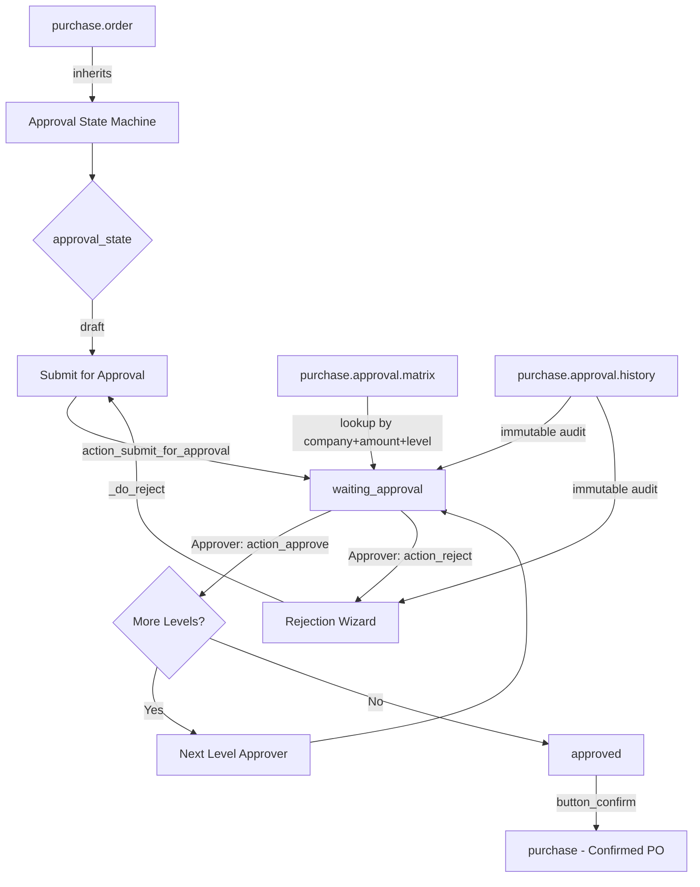
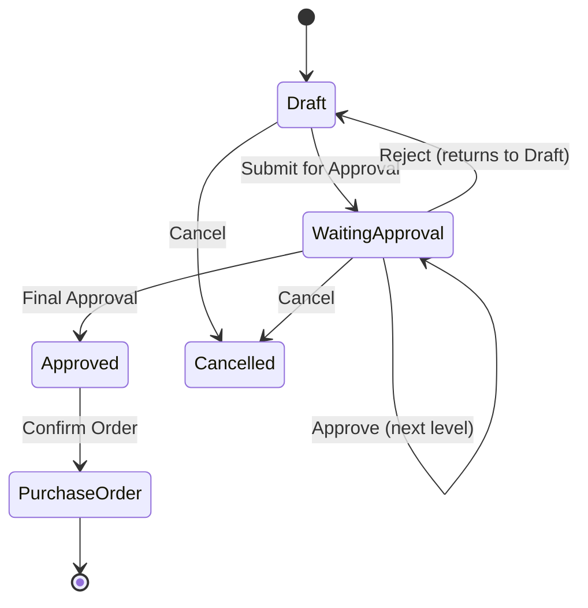

# Purchase Approval Workflow

**Version:** 19.0.1.0.0  
**License:** LGPL-3  
**Dependencies:** `purchase`, `mail`, `hr`

---

## Overview

`purchase_approval_workflow` introduces a fully configurable, multi-level purchase order approval workflow for Odoo 19. Every RFQ created by a purchase user must pass through a configurable approval matrix before it can be confirmed as a Purchase Order.

---

## Architecture Diagram



---

## Workflow Diagram



---

## Installation Guide

1. Copy the `purchase_approval_workflow` folder into your Odoo addons path.
2. Restart the Odoo service.
3. Update the apps list (Settings → Apps → Update Apps List).
4. Search for "Purchase Approval Workflow" and click **Install**.
5. The module automatically enables the workflow after installation.

---

## Configuration Guide

### Step 1 — Enable the Workflow

Navigate to **Purchase → Configuration → Settings** and scroll to the **Purchase Approval Workflow** section.

| Setting | Description |
|---------|-------------|
| Enable Approval Workflow | Master switch. Must be ON for the workflow to activate. |
| Enable Multi-Level Approval | Supports sequential approvals at multiple levels. |
| Enable Email Notifications | Sends automated emails at each workflow step. |
| Enable Mail Activities | Creates Odoo activities for approvers. |
| Allow Manager Override | Purchase Approval Managers can approve any order. |
| Auto-Confirm After Final Approval | Automatically confirms the PO after the last approval. |

### Step 2 — Configure the Approval Matrix

Navigate to **Purchase → Configuration → Approval Matrix** and create rules:

| Field | Description |
|-------|-------------|
| Rule Name | Descriptive name for this rule |
| Sequence | Lower sequence = higher priority when multiple rules match |
| Company | Multi-company isolation |
| Approval Level | 1 = first approval, 2 = second, etc. |
| Min Amount | Minimum PO total (in company currency) |
| Max Amount | Maximum PO total (0 = unlimited) |
| Approver (User) | Specific user who must approve |
| Approver (Group) | Any user in this group can approve (fallback) |
| Department | Optional: limits rule to orders from this department |
| Product Category | Optional: limits rule to orders containing this category |

**Example multi-level setup:**

| Sequence | Level | Min | Max | Approver |
|----------|-------|-----|-----|----------|
| 10 | 1 | 0 | 5,000 | Supervisor |
| 20 | 1 | 5,001 | 0 | Purchase Manager |
| 10 | 2 | 5,001 | 0 | Finance Manager |

### Step 3 — Assign Security Groups

Go to **Settings → Users** and assign users to the appropriate groups:

| Group | Purpose |
|-------|---------|
| Purchase Approval User | Can view approval data and submit orders |
| Purchase Approval Manager | Can approve / reject orders |
| Purchase Approval Administrator | Full override + matrix configuration |

---

## User Guide

### Purchase User (Buyer)

1. Create an RFQ as normal.
2. Add order lines and verify the order.
3. Click **Submit for Approval** (replaces "Confirm Order" for unapproved orders).
4. The RFQ status changes to **Waiting Approval**.
5. You will be notified when the order is approved or rejected.
6. If approved: click **Confirm Order** to complete the purchase.
7. If rejected: review the reason in the chatter, revise, and resubmit.

### Approver (Purchase Approval Manager)

1. You will receive an email and/or an activity when a PO requires your approval.
2. Open the PO from the notification or from the Purchase Orders list.
3. Review the order details.
4. Click **Approve** to approve or **Reject** to reject.
5. If rejecting: a mandatory reason must be entered in the wizard.
6. Your decision is permanently recorded in the Approval History.

---

## Developer Guide

### Key Models

| Model | Purpose |
|-------|---------|
| `purchase.order` | Extended with `approval_state`, `display_state`, and all workflow fields |
| `purchase.approval.matrix` | Configurable rules: who approves what, at which level |
| `purchase.approval.history` | Immutable audit trail — one record per approval decision |
| `purchase.approval.reject.wizard` | Transient model for capturing mandatory rejection reasons |
| `res.config.settings` | Extended with 6 workflow settings stored as `ir.config_parameter` |

### Key Fields on `purchase.order`

| Field | Type | Description |
|-------|------|-------------|
| `approval_state` | Selection | `draft / waiting_approval / approved / rejected` |
| `display_state` | Selection (computed, stored) | Unified statusbar field |
| `submitted_by` | Many2one(res.users) | Who submitted for approval |
| `current_approver_id` | Many2one(res.users) | Who needs to approve now |
| `current_approval_level` | Integer | Which level is currently active |
| `current_approval_matrix_id` | Many2one(purchase.approval.matrix) | Active rule |
| `can_approve` | Boolean (computed) | Whether the current user can approve this PO |
| `approval_workflow_enabled` | Boolean (computed) | Whether the workflow is active |

### Overridden Methods

| Method | Reason |
|--------|--------|
| `button_confirm()` | Blocks confirmation if not approved (calls `super()` after check) |
| `write()` | Prevents editing in `waiting_approval` state (bypassed by `approval_workflow_action` context) |
| `unlink()` | Prevents deletion when in approval process |

### Internal Bypass Context

Use `with_context(approval_workflow_action=True)` when the workflow itself needs to write approval-specific fields on the PO. This bypasses the write restriction that protects regular users from editing during approval.

```python
self.with_context(approval_workflow_action=True).write({
    'approval_state': 'approved',
    'approved_by': self.env.uid,
})
```

### Running Tests

```bash
python odoo-bin -c your.conf --test-enable --stop-after-init -i purchase_approval_workflow
```

---

## Upgrade Safety Notes

- All fields added via `_inherit` — no core modifications.
- No SQL, no monkey patching, no JavaScript.
- `ir.config_parameter` keys are namespaced with `purchase_approval_workflow.` to avoid collisions.
- All XML IDs are namespaced with `purchase_approval_workflow.`.
- View inheritance uses stable xpaths (button IDs `bid_confirm` and `draft_confirm`) — will need review if Odoo renames them in future versions.
- The `purchase.approval.history.write()` and `unlink()` raise `UserError` by design — this is the immutability enforcement, not a bug.
